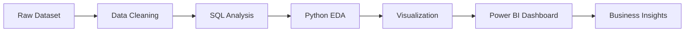
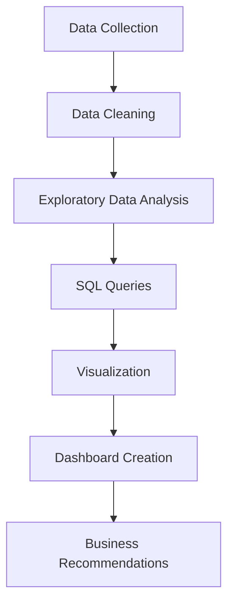

<!-- =========================
        ANIMATED HEADER
========================= -->

#  Olist E-Commerce Analytics

### Transforming Raw E-Commerce Data into Business Intelligence Insights

  
  
  
  
  

---

#  Table of Contents

- [ About Project](#-about-project)
- [ Objectives](#-objectives)
- [ Business Problems Solved](#-business-problems-solved)
- [ Tech Stack](#️-tech-stack)
- [ Dataset Information](#-dataset-information)
- [ Dashboard Preview](#-dashboard-preview)
- [ Key Insights](#-key-insights)
- [ Project Architecture](#️-project-architecture)
- [ Workflow](#-workflow)
- [ Screenshots](#-screenshots)
- [ Future Enhancements](#-future-enhancements)
- [ Connect With Me](#-connect-with-me)

---

#  About Project

This project focuses on analyzing the **Brazilian Olist E-Commerce Dataset** to uncover valuable business insights related to:

- Customer purchasing behavior
- Revenue growth trends
- Seller performance
- Product category analysis
- Delivery performance
- Customer satisfaction
- Payment patterns

The goal is to transform raw transactional data into actionable insights using modern data analytics and visualization tools.

---

#  Objectives

✔ Analyze overall sales performance  
✔ Identify top-performing product categories  
✔ Study customer retention & repeat purchases  
✔ Understand seller contribution & ratings  
✔ Analyze payment behavior  
✔ Visualize trends with interactive dashboards  
✔ Generate business recommendations

---

#  Business Problems Solved

| Problem | Solution |
|---|---|
| Low customer retention | Repeat customer analysis |
| Revenue fluctuation | Time-series sales trends |
| Poor delivery performance | Shipping & delivery KPI tracking |
| Product optimization | Category-wise sales analysis |
| Seller performance | Rating & revenue correlation |

---

# Tech Stack

  

---

#  Dataset Information

###  Dataset Source
Brazilian E-Commerce Public Dataset by Olist

###  Dataset Includes

- Orders
- Customers
- Sellers
- Products
- Reviews
- Payments
- Geolocation Data

###  Time Period

2016 – 2018

---

#  Dashboard Preview

---

#  Key Insights

##  Revenue Insights
- Peak sales observed during seasonal shopping periods
- Significant growth in repeat customer revenue

##  Product Analysis
- Bed Bath Table category generated highest sales
- Health & Beauty maintained stable revenue growth

##  Delivery Insights
- Faster delivery correlated with higher review scores
- Delayed orders significantly impacted ratings

##  Customer Satisfaction
- Most customers rated products between 4 and 5 stars
- Negative reviews linked with delivery delays

---

#  Project Architecture

---

#  Workflow

---

#  Screenshots

  

---

#  Future Enhancements

-  Real-time analytics pipeline
-  Cloud deployment on AWS/GCP
-  Kafka-based streaming analytics
-  Machine Learning sales forecasting
-  Advanced customer segmentation

---

#  Repository Stats

---

#  Connect With Me

---

## ⭐ If you found this project useful, give it a star!

